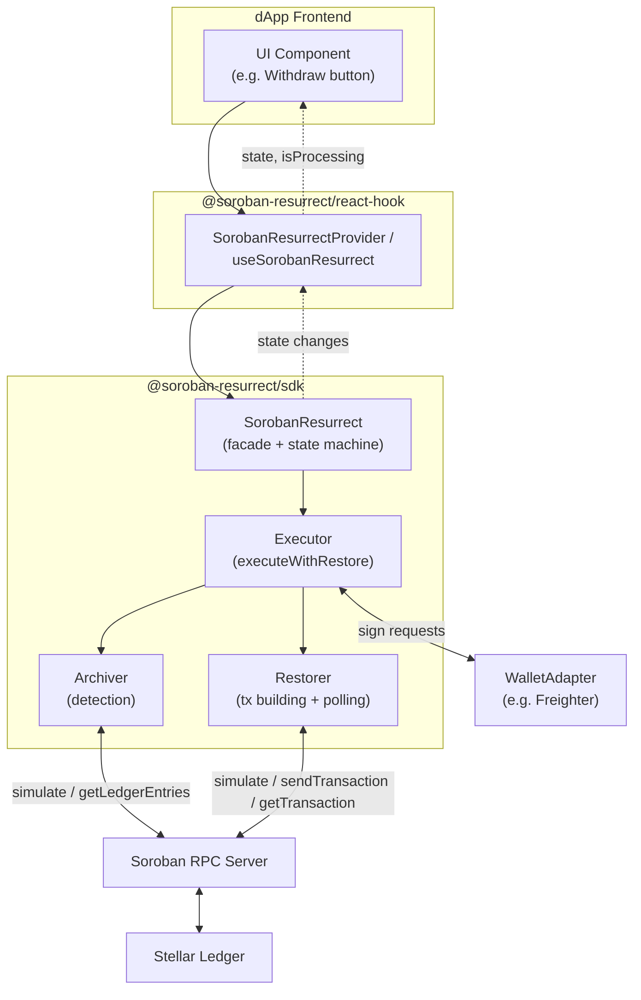
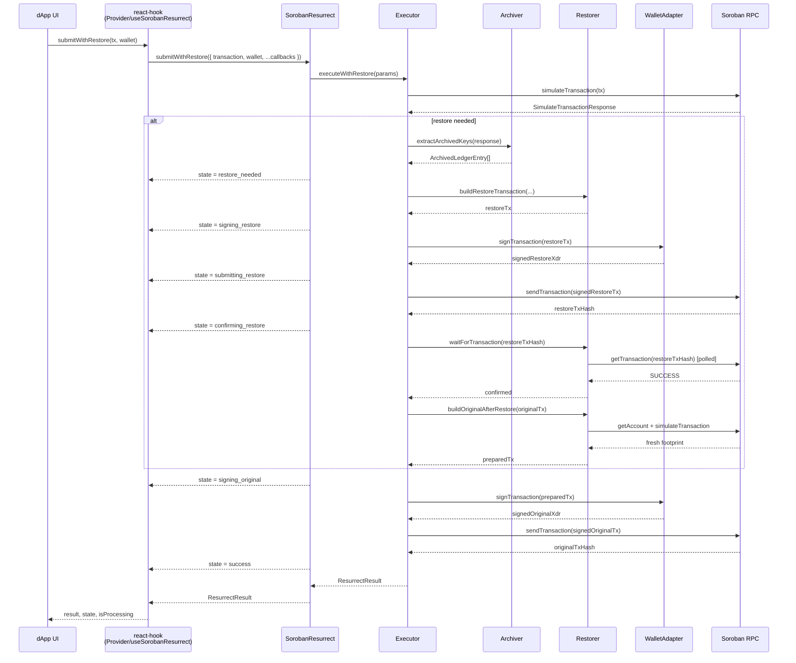
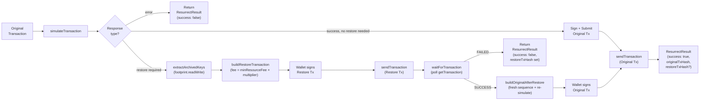
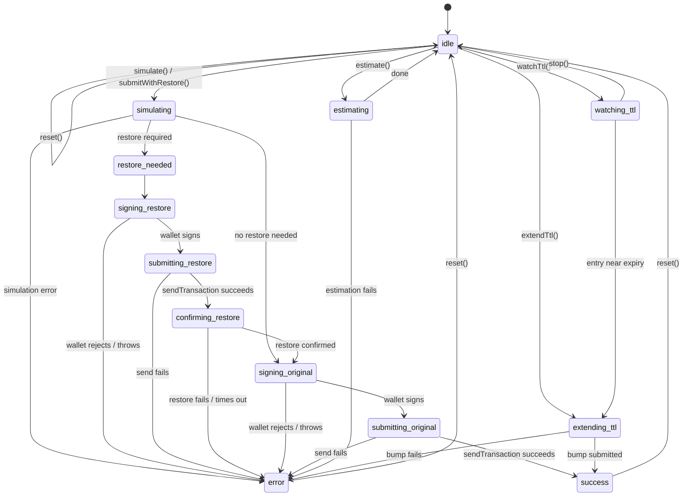

# Architecture

This document explains how Soroban-Resurrect is put together: the problem it
solves, how data flows through the system, the workflow's state machine, and
how the packages and their internal modules interact.

For a member-by-member API reference, see [`docs/API.md`](docs/API.md). For
quick-start usage examples, see the main [`README.md`](README.md).

## Contents

- [The problem: CAP-0066 archived ledger entries](#the-problem-cap-0066-archived-ledger-entries)
- [System overview](#system-overview)
- [Packages](#packages)
- [Component interaction](#component-interaction)
- [Data flow](#data-flow)
- [The restore workflow, step by step](#the-restore-workflow-step-by-step)
- [State machine](#state-machine)
- [Failure handling](#failure-handling)
- [Archive detection strategies](#archive-detection-strategies)

## The problem: CAP-0066 archived ledger entries

Soroban contract state that isn't touched for a while can have its TTL
("time to live") expire and become **archived**. The ledger entry still
exists, but a transaction that reads or writes it will fail unless it's
restored first. [CAP-0066](https://github.com/stellar/stellar-protocol/blob/master/core/cap-0066.md)
defines the on-chain mechanism for this: a `restoreFootprint` operation that
extends the TTL of the entries named in a transaction's footprint.

Without tooling, a dApp user who hits this sees a cryptic simulation error
and has no way to recover without a developer manually building and
submitting a separate restore transaction. Soroban-Resurrect automates that
recovery end-to-end: detect → build restore tx → sign → submit → confirm →
rebuild and submit the user's original transaction.

## System overview

## Packages

| Package                         | Responsibility                                                                                                                                                                                     |
| ------------------------------- | -------------------------------------------------------------------------------------------------------------------------------------------------------------------------------------------------- |
| `@soroban-resurrect/sdk`        | Framework-agnostic core: detects archived entries, builds and submits restore transactions, and orchestrates the full restore-and-submit workflow. No React dependency.                            |
| `@soroban-resurrect/react-hook` | Thin React binding over the SDK — a context provider (`SorobanResurrectProvider`) and a standalone hook (`useSorobanResurrect`), both exposing the same reactive `state` / `isProcessing` surface. |
| `examples/basic`                | Vite + React demo app wiring the react-hook package to a Freighter wallet connect + withdraw flow.                                                                                                 |

Within `@soroban-resurrect/sdk`, responsibilities are split by module:

| Module                | Responsibility                                                                                                                                             |
| --------------------- | ---------------------------------------------------------------------------------------------------------------------------------------------------------- |
| `SorobanResurrect.ts` | Public facade class. Wraps the RPC server, exposes the state machine and listener API, and delegates the actual workflow to `Executor`.                    |
| `Executor.ts`         | `executeWithRestore` — the stateless orchestration function that runs simulate → (restore if needed) → submit, invoking lifecycle callbacks along the way. |
| `Archiver.ts`         | Simulation-response type guards and archived-key extraction/detection (`simulation` and `direct` strategies).                                              |
| `Restorer.ts`         | Transaction building: `buildRestoreTransaction`, `buildOriginalAfterRestore`, `prepareTransaction`, plus `waitForTransaction` polling with backoff.        |
| `types.ts`            | Shared TypeScript interfaces and the `RestoreState` union.                                                                                                 |
| `constants.ts`        | Defaults (network passphrase, poll interval/timeout, fee multiplier).                                                                                      |

## Component interaction

How the pieces talk to each other for a single `submitWithRestore()` call:

## Data flow

How a transaction and its metadata flow through the system, from footprint
detection to confirmation:

## The restore workflow, step by step

`SorobanResurrect.submitWithRestore()` (backed by `executeWithRestore`)
performs the following steps. Each step updates `state`/`stateInfo` and
fires the corresponding optional callback passed to `submitWithRestore()`.

1. **Simulate** — the original transaction is simulated via
   `server.simulateTransaction()`. State: `simulating`.
2. **Classify the response** using the `Archiver` type guards:
   - `isErrorResponse` → the workflow stops and returns
     `{ success: false, error }` immediately (state: `error`).
   - `isSuccessResponse` (no restore needed) → skip to step 7.
   - `isRestoreResponse` → continue to step 3.
3. **Extract archived keys** — `extractArchivedKeys()` reads the
   read-write footprint off the restore response. State: `restore_needed`,
   and `onRestoreNeeded(archivedKeys)` fires.
4. **Build the restore transaction** — `buildRestoreTransaction()`
   constructs a transaction with a single `Operation.restoreFootprint({})`,
   using the simulation's `transactionData` and a fee of
   `minResourceFee × restoreFeeMultiplier` (default multiplier: `100`).
5. **Sign and submit the restore transaction** — the wallet is prompted to
   sign (state: `signing_restore`, then `submitting_restore` once sent via
   `server.sendTransaction()`).
6. **Confirm the restore** — `waitForTransaction()` polls
   `server.getTransaction()` with exponential backoff (100ms → doubling,
   capped at `pollIntervalMs`, ±50% jitter) until the restore reaches a
   terminal status or `pollTimeoutMs` elapses (state: `confirming_restore`).
   On success, `onRestoreConfirmed(txHash)` fires and the flow proceeds;
   on failure or timeout, the workflow stops and returns an error result
   with `restoreTxHash` set.
7. **Rebuild the original transaction** — `buildOriginalAfterRestore()`
   fetches a fresh account sequence number, copies the original
   transaction's operations, re-simulates, and assembles the result. This
   guarantees the transaction reflects the now-restored ledger state.
8. **Sign and submit the original transaction** — the wallet is prompted
   again (state: `signing_original`, then `submitting_original`), and the
   transaction is sent via `server.sendTransaction()`.
9. **Success** — state transitions to `success`, `onOriginalSubmitted(txHash)`
   fires, and a `ResurrectResult` with `success: true`, `originalTxHash`,
   and (if a restore happened) `restoreTxHash` and `archivedKeysDetected`
   is returned.

If no restore was needed (step 2 short-circuit), steps 3–7 are skipped
entirely and the original transaction is signed and submitted directly.

## State machine

`RestoreState` (in `types.ts`) tracks exactly where a `submitWithRestore()`
call is in the workflow above. Subscribe via
`resurrect.onStateChange(listener)` to drive UI (loading indicators,
status text) off of it — this is what `isProcessing` in the React hook is
derived from.

`reset()` clears `error`/`archivedKeys` and returns to `idle` from any
state, so a UI can always offer a "try again" action.

### Proactive / estimation states

`estimating`, `watching_ttl`, and `extending_ttl` are **additive** — they
model long-running activity outside the reactive submit flow (fee
estimation and proactive TTL watch-and-extend). The `RestoreState` union
is a superset of the original states, so existing consumers keep working
unchanged. `isProcessingState()` returns `true` for `estimating` and
`extending_ttl` (active work) and `false` for `watching_ttl` (a passive
background poll, like `idle`); its result for every pre-existing state is
unchanged.

## Failure handling

`submitWithRestore()` / `executeWithRestore()` never throw — every failure
path is caught and returned as a structured `ResurrectResult`:

- **Simulation errors** are returned immediately with the error message
  (`state: error`, no restore or submission attempted).
- **Wallet not connected** (checked before requesting a public key) returns
  an error without prompting the wallet.
- **Restore transaction failure** (send error, or `waitForTransaction`
  reports `FAILED`/times out) returns `restoreTxHash` alongside the error,
  so the caller can look up what happened on-chain.
- **Re-simulation failure after restore** — if `buildOriginalAfterRestore`'s
  re-simulation still indicates archived entries, this is treated as an
  unusual/unexpected condition (the restore should have been sufficient)
  and surfaces as an error.
- **Signed-transaction parsing failures** (e.g. a wallet returns malformed
  XDR) are caught and returned as errors rather than throwing.
- Every exception is caught at the outermost level of `executeWithRestore`
  and converted into `{ success: false, error: message }`.

`onRestoreFailed` fires for any error that occurs during or after restore
initiation, independent of the specific failure point above.

## Archive detection strategies

`SorobanResurrectConfig.archiveDetectionMethod` selects how
`detectArchivedKeys()` / `needsRestore()` look for archived entries:

- **`simulation`** (default) — simulate the transaction and check whether
  the RPC server itself returns a restore-required response
  (`Api.isSimulationRestore`). Cheap (one RPC call) and matches exactly
  what `submitWithRestore` will encounter, but only reports entries that
  are actually in the transaction's footprint _and_ currently archived.
- **`direct`** — simulate in success mode to obtain the read-write
  footprint, then query `getLedgerEntries` directly (in chunks of 50) to
  see which of those keys are missing from the ledger. Useful for
  monitoring/diagnostics without triggering a restore-response path; on a
  chunk request failure, keys in that chunk are conservatively treated as
  archived to avoid false negatives.

Both strategies feed into the same `ArchivedLedgerEntry[]` shape and the
same downstream restore-building code in `Restorer.ts`.
