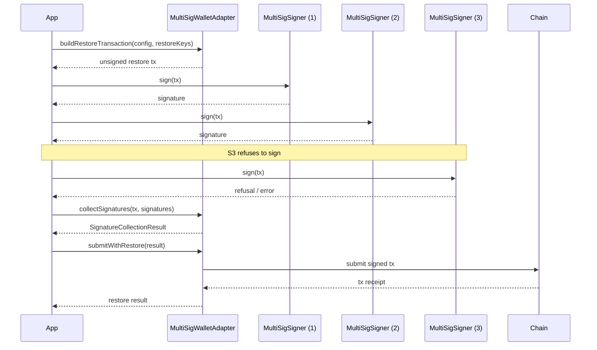

# API Reference

This document describes the public API surface of the SDK. For integration guides see
[`docs/integrations/adapters-and-wallets.md`](./integrations/adapters-and-wallets.md).

## MultiSig restore

N-of-M restore support is provided by `MultiSigWalletAdapter`, `MultiSigSigner`,
`MultiSigConfig`, and `SignatureCollectionResult`. The flow is **collect-then-submit**: build a
restore transaction, collect signatures from each signer, then submit the fully signed
transaction.

### Sequence diagram



### Composing with `submitWithRestore` and `restoreKeys`

- `restoreKeys` are the keys being restored; they are passed when building the restore
  transaction and are not required again at submit time.
- `submitWithRestore` accepts the `SignatureCollectionResult` produced by
  `collectSignatures` and submits it once the threshold is met. It does not re-collect
  signatures, so a partial collection can be resumed and submitted later.

### Worked 2-of-3 example

```ts
import {
  MultiSigWalletAdapter,
  MultiSigConfig,
  MultiSigSigner,
} from "@sdk/wallets";

const config: MultiSigConfig = {
  threshold: 2,
  signers: [signerA, signerB, signerC],
};

const adapter = new MultiSigWalletAdapter(config);

// 1. Build the restore transaction for the keys being restored.
const tx = await adapter.buildRestoreTransaction({ restoreKeys });

// 2. Collect signatures from each signer (2 of 3 required).
const signatures = [];
for (const signer of [signerA, signerB]) {
  signatures.push(await signer.sign(tx));
}

const result = await adapter.collectSignatures(tx, signatures);

// 3. Submit once the threshold is met.
const receipt = await adapter.submitWithRestore(result);
```

### Failure handling for a refusing signer

If a signer refuses (throws or returns an error), `collectSignatures` records the failure in
the returned `SignatureCollectionResult` rather than aborting the whole flow. As long as the
number of successful signatures still meets `config.threshold`, the result can be passed to
`submitWithRestore`. If the threshold is not met, `submitWithRestore` rejects and the partial
result can be retained to collect the remaining signatures later.

### Types

| Type | Description |
| --- | --- |
| `MultiSigWalletAdapter` | Builds restore transactions, collects signatures, and submits them. |
| `MultiSigSigner` | A single signer that produces a signature for a restore transaction. |
| `MultiSigConfig` | Threshold and signer set for an N-of-M wallet. |
| `SignatureCollectionResult` | Outcome of `collectSignatures`, including collected signatures and per-signer failures. |

## Restore cost estimation

`estimateRestoreCost(transaction)` is the read-only companion to a restore flow. It inspects a
transaction's footprint, determines whether any of its keys are archived, and returns the extra
fee a restore would incur — **without submitting anything**. Use it to show the user what a
restore will cost before they sign.

```ts
function estimateRestoreCost(transaction: Transaction): Promise<RestoreCostEstimate>;
```

### `RestoreCostEstimate`

| Field | Type | Description |
| --- | --- | --- |
| `minResourceFee` | `number` | Minimum resource fee for the restore, in stroops. |
| `multiplier` | `number` | Fee multiplier applied to the restore resources. |
| `estimatedFee` | `number` | Total estimated restore fee (`minResourceFee` scaled by `multiplier`), in stroops. |
| `archivedKeysDetected` | `LedgerKey[]` | Footprint keys found to be archived and therefore needing a restore. |
| `wouldNeedRestore` | `boolean` | `true` when at least one archived key was detected; `false` when no restore is required. |

### Zero-fee behaviour (`wouldNeedRestore: false`)

When none of the transaction's footprint keys are archived, `wouldNeedRestore` is `false` and
`estimatedFee` is `0` (with `archivedKeysDetected` empty). In that case no restore is needed and
the transaction can be submitted as-is — you should not add the estimated fee to the user's
cost, and you can skip the restore confirmation entirely.

### Worked example: confirm the cost before signing

```ts
import { estimateRestoreCost } from "@sdk/restore";

const estimate = await estimateRestoreCost(tx);

if (estimate.wouldNeedRestore) {
  // Show the extra cost to the user before they sign.
  const feeXlm = estimate.estimatedFee / 10_000_000;
  const confirmed = await ui.confirm(
    `This transaction needs a restore of ${estimate.archivedKeysDetected.length} ` +
      `archived key(s) and will cost an extra ${feeXlm} XLM. Continue?`,
  );
  if (!confirmed) return;
} else {
  // No archived keys: no restore, no extra fee.
  console.log("No restore needed; submitting as-is.");
}

// Proceed to sign and submit only after the user has seen the cost.
const signed = await signer.sign(tx);
await submit(signed);
```

See the [fee-model guide](./guide/fees.md) and the [TTL guides](./guide/ttl.md) for how restore
fees fit into the overall fee model and TTL management.

## Contract and account scanning

The scanning APIs answer "what in my contract or account is about to expire?" **without
submitting a transaction**. They are read-only and safe to call from any client.

### `getExpiringEntriesForContract`

Scans a contract's entries and returns the ones whose TTL is at or below the configured
threshold.

```ts
type ContractScanOptions = {
  /** Ledger offset below which an entry is considered "expiring soon". */
  expiringSoonLedgers?: number;
  /** Instance entry to scan, if any. */
  instance?: LedgerKey;
  /** Wasm code entry to scan, if any. */
  wasmCode?: LedgerKey;
  /** Storage keys to scan. */
  storageKeys?: LedgerKey[];
};

type ContractScanResult = {
  instance?: ClassicEntryStatus;
  wasmCode?: ClassicEntryStatus;
  storage: ClassicEntryStatus[];
};

type ClassicEntryStatus = {
  key: LedgerKey;
  liveUntilLedger: number;
  expiringSoon: boolean;
};

function getExpiringEntriesForContract(
  contractId: string,
  options?: ContractScanOptions,
): Promise<ContractScanResult>;
```

> **Important limitation:** a contract's storage keys **cannot be enumerated** from the
> ledger. You must supply the storage keys you care about via `options.storageKeys`.
> Only the instance and wasm code entries can be discovered automatically. If you omit
> `storageKeys`, the result's `storage` array will be empty.

`DEFAULT_EXPIRING_SOON_LEDGERS` is the default threshold used when `expiringSoonLedgers`
is not provided.

### `getExpiringEntriesForAccount`

Scans an account's presence and trustline entries. This is a **presence scan**, not a TTL
scan: it reports whether the account and its trustlines exist, separately from any TTL
information.

```ts
type AccountScanOptions = {
  /** Trustline asset keys to check for presence. */
  trustlines?: LedgerKey[];
};

function getExpiringEntriesForAccount(
  accountId: string,
  options?: AccountScanOptions,
): Promise<ContractScanResult>;
```

### Worked example: instance, wasm code, and storage keys

```ts
import {
  getExpiringEntriesForContract,
  getExpiringEntriesForAccount,
  DEFAULT_EXPIRING_SOON_LEDGERS,
} from "@sdk/scanning";

// Contract scan: instance + wasm code are discovered automatically, but storage
// keys MUST be supplied by the caller.
const contractResult = await getExpiringEntriesForContract(contractId, {
  expiringSoonLedgers: DEFAULT_EXPIRING_SOON_LEDGERS,
  instance: instanceKey,
  wasmCode: wasmCodeKey,
  storageKeys: [balanceKey, allowanceKey],
});

if (contractResult.instance?.expiringSoon) {
  console.warn("contract instance is expiring soon");
}
for (const entry of contractResult.storage) {
  if (entry.expiringSoon) {
    console.warn("storage entry expiring soon", entry.key);
  }
}

// Account scan: presence of the account and its trustlines.
const accountResult = await getExpiringEntriesForAccount(accountId, {
  trustlines: [usdcTrustlineKey],
});
```

### When to use scanning vs. `detectArchivedKeys`

| API | Basis | Use when |
| --- | --- | --- |
| `getExpiringEntriesForContract` / `getExpiringEntriesForAccount` | Explicit keys you supply | You know which keys matter and want a transaction-free, read-only check. |
| `detectArchivedKeys` | Transaction footprint | You have a transaction and want to know which of its footprint keys are archived. |

Use the scanning APIs for proactive, transaction-free monitoring; use `detectArchivedKeys`
when you already have a transaction and need to inspect its footprint.
