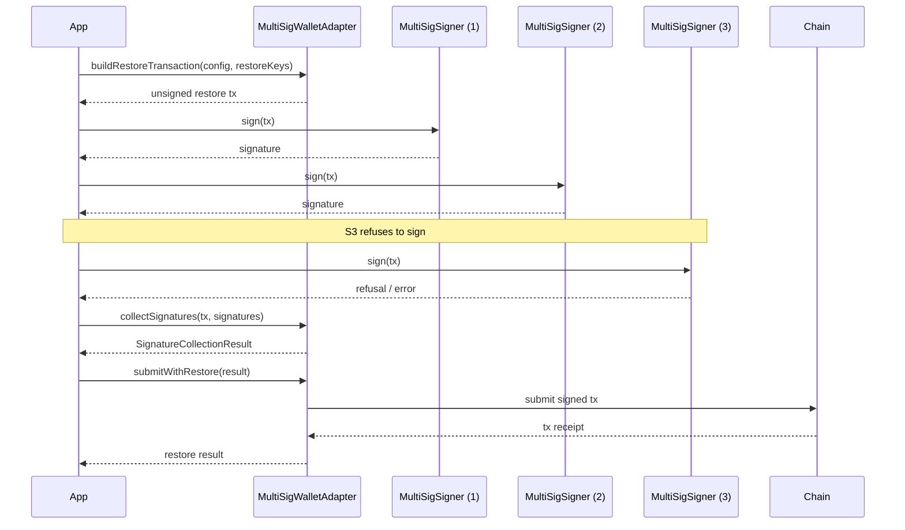

# API Reference

This document describes the public API surface of the SDK. For integration guides see
[`docs/integrations/adapters-and-wallets.md`](./integrations/adapters-and-wallets.md).

## MultiSig restore

N-of-M restore support is provided by `MultiSigWalletAdapter`, `MultiSigSigner`,
`MultiSigConfig`, and `SignatureCollectionResult`. The flow is **collect-then-submit**: build a
restore transaction, collect signatures from each signer, then submit the fully signed
transaction.

### Sequence diagram



### Composing with `submitWithRestore` and `restoreKeys`

- `restoreKeys` are the keys being restored; they are passed when building the restore
transaction and are not required again at submit time.
- `submitWithRestore` accepts the `SignatureCollectionResult` produced by
  `collectSignatures` and submits it once the threshold is met. It does not re-collect
  signatures, so a partial collection can be resumed and submitted later.

### Worked 2-of-3 example

```ts
import {
  MultiSigWalletAdapter,
  MultiSigConfig,
  MultiSigSigner,
} from "@sdk/wallets";

const config: MultiSigConfig = {
  threshold: 2,
  signers: [signerA, signerB, signerC],
};

const adapter = new MultiSigWalletAdapter(config);

// 1. Build the restore transaction for the keys being restored.
const tx = await adapter.buildRestoreTransaction({ restoreKeys });

// 2. Collect signatures from each signer (2 of 3 required).
const signatures = [];
for (const signer of [signerA, signerB]) {
  signatures.push(await signer.sign(tx));
}

const result = await adapter.collectSignatures(tx, signatures);

// 3. Submit once the threshold is met.
const receipt = await adapter.submitWithRestore(result);
```

### Failure handling for a refusing signer

If a signer refuses (throws or returns an error), `collectSignatures` records the failure in
the returned `SignatureCollectionResult` rather than aborting the whole flow. As long as the
number of successful signatures still meets `config.threshold`, the result can be passed to
`submitWithRestore`. If the threshold is not met, `submitWithRestore` rejects and the partial
result can be retained to collect the remaining signatures later.

### Types

| Type | Description |
| --- | --- |
| `MultiSigWalletAdapter` | Builds restore transactions, collects signatures, and submits them. |
| `MultiSigSigner` | A single signer that produces a signature for a restore transaction. |
| `MultiSigConfig` | Threshold and signer set for an N-of-M wallet. |
| `SignatureCollectionResult` | Outcome of `collectSignatures`, including collected signatures and per-signer failures. |
