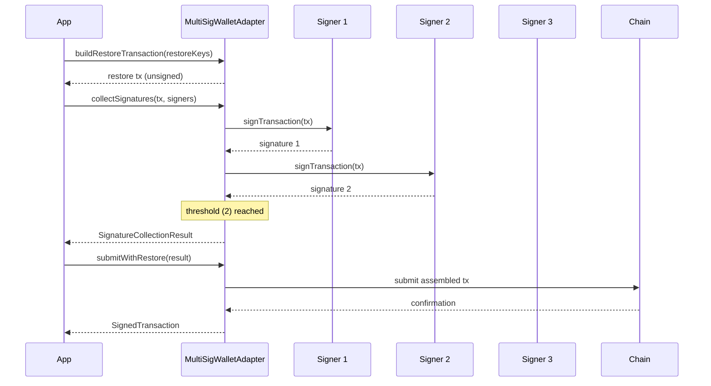

# SDK API

The `@handsoff/sdk` package exposes the wallet adapter layer used by every integration.
This page documents the `WalletAdapter` contract, the `createAdapter` factory, the
`KnownWallet` / `SUPPORTED_WALLETS` registry, the capability flags, the hardware
wallet setup for Ledger and Trezor, the N-of-M multisig restore flow, and the
transaction-free contract and account scanning APIs.

## `WalletAdapter`

Every wallet integration implements the same contract:

```ts
export interface WalletAdapter {
  /** Stable identifier, usually a `KnownWallet` value. */
  readonly id: string;
  /** Human readable name shown in wallet pickers. */
  readonly name: string;
  /** Capabilities this adapter supports. */
  readonly capabilities: WalletCapabilities;
  /** Connect and resolve the active account. */
  connect(): Promise<WalletAccount>;
  /** Disconnect and release any transport resources. */
  disconnect(): Promise<void>;
  /** Sign a transaction payload. */
  signTransaction(tx: Transaction): Promise<SignedTransaction>;
  /** Sign an arbitrary message. */
  signMessage(message: Uint8Array): Promise<Uint8Array>;
}
```

## `createAdapter`

`createAdapter` is the factory used to instantiate an adapter from a `KnownWallet`
value or a custom adapter class. It normalises configuration, applies defaults, and
returns a ready-to-use `WalletAdapter`.

```ts
import { createAdapter, KnownWallet } from '@handsoff/sdk';

const adapter = createAdapter(KnownWallet.Phantom);
await adapter.connect();
```

It accepts either a known wallet or a custom adapter:

```ts
const adapter = createAdapter({
  wallet: KnownWallet.Ledger,
  config: { transport, manifest },
});
```

## `KnownWallet` and `SUPPORTED_WALLETS`

`KnownWallet` enumerates every wallet the SDK ships an adapter for. `SUPPORTED_WALLETS`
is the runtime list (id, name, capabilities) used to build wallet pickers.

| `KnownWallet` value | Adapter | Notes |
| --- | --- | --- |
| `KnownWallet.Phantom` | `PhantomWalletAdapter` | Browser extension |
| `KnownWallet.Solflare` | `SolflareWalletAdapter` | Browser extension |
| `KnownWallet.Backpack` | `BackpackWalletAdapter` | Browser extension |
| `KnownWallet.Glow` | `GlowWalletAdapter` | Browser extension |
| `KnownWallet.Ledger` | `LedgerWalletAdapter` | Hardware, requires transport + manifest |
| `KnownWallet.Trezor` | `TrezorWalletAdapter` | Hardware, requires transport + manifest |

```ts
import { SUPPORTED_WALLETS } from '@handsoff/sdk';

for (const wallet of SUPPORTED_WALLETS) {
  console.log(wallet.id, wallet.name, wallet.capabilities);
}
```

## Capability flags

Each adapter advertises what it can do. The SDK branches on these flags, so an
unsupported operation fails fast instead of silently degrading.

| Flag | Meaning | SDK behaviour that depends on it |
| --- | --- | --- |
| `signTransaction` | Can sign transactions | `signTransaction()` is exposed; otherwise the call throws `UnsupportedCapabilityError` |
| `signMessage` | Can sign arbitrary messages | `signMessage()` is exposed; used by auth / SIWS flows |
| `hardware` | Backed by a hardware device | Enables transport lifecycle management and blind-signing warnings |
| `blindSigning` | Device can sign without full display | SDK emits a blind-signing warning before signing |
| `multiAccount` | Can expose multiple accounts | Account picker is shown after `connect()` |

## Hardware wallets

Hardware adapters need a transport to talk to the device and a manifest so the
device can display the requesting app. Both are passed through `createAdapter`.

### Ledger

```bash
npm install @ledgerhq/hw-transport-webhid @ledgerhq/hw-app-solana
```

```ts
import TransportWebHID from '@ledgerhq/hw-transport-webhid';
import { createAdapter, KnownWallet } from '@handsoff/sdk';

const transport = await TransportWebHID.create();

const adapter = createAdapter({
  wallet: KnownWallet.Ledger,
  config: {
    transport,
    manifest: {
      name: 'My App',
      url: 'https://example.com',
      icon: 'https://example.com/icon.png',
    },
  } satisfies LedgerAdapterConfig,
});
```

### Trezor

```bash
npm install @trezor/connect-web
```

```ts
import TrezorConnect from '@trezor/connect-web';
import { createAdapter, KnownWallet } from '@handsoff/sdk';

await TrezorConnect.init({
  manifest: {
    email: 'dev@example.com',
    appUrl: 'https://example.com',
  },
});

const adapter = createAdapter({
  wallet: KnownWallet.Trezor,
  config: { connect: TrezorConnect } satisfies TrezorAdapterConfig,
});
```

### Latency and UX

Hardware signing is interactive: the user must confirm on the device. Expect
several seconds per signature versus sub-second for browser wallets, and design
flows so each signature is a deliberate step. When `blindSigning` is set the SDK
warns the user that the device cannot display the full payload before they confirm.

## Custom adapters

Implement `WalletAdapter` and pass the class to `createAdapter`:

```ts
import { createAdapter, type WalletAdapter } from '@handsoff/sdk';

class MyWalletAdapter implements WalletAdapter {
  readonly id = 'my-wallet';
  readonly name = 'My Wallet';
  readonly capabilities = {
    signTransaction: true,
    signMessage: false,
    hardware: false,
    blindSigning: false,
    multiAccount: false,
  };

  async connect() {
    /* ... */
  }
  async disconnect() {
    /* ... */
  }
  async signTransaction(tx) {
    /* ... */
  }
  async signMessage() {
    throw new Error('signMessage is not supported');
  }
}

const adapter = createAdapter({ adapter: MyWalletAdapter });
```

## Contract and account scanning

The scanning APIs answer "what in my contract or account is about to expire?"
without submitting a transaction. They read ledger entries directly and report
which ones are close to their TTL, so a dApp can prompt the user to extend or
restore state before it is archived.

### `getExpiringEntriesForContract`

Scans a contract's instance, wasm code, and storage entries for TTLs that fall
within the expiring-soon window.

> **Important:** a contract's storage keys **cannot be enumerated** on-chain. The
> SDK has no way to discover which keys a contract wrote, so **you must supply the
> storage keys yourself**. Instance and wasm code entries are discovered
> automatically; storage entries are only scanned for the keys you pass in.

```ts
export interface ContractScanOptions {
  /** Contract address to scan. */
  contractId: PublicKey;
  /** Storage keys to check. Required — keys cannot be enumerated on-chain. */
  storageKeys: PublicKey[];
  /** Ledger threshold (in ledgers) below which an entry is "expiring soon". */
  expiringSoonLedgers?: number;
}

export interface ContractScanResult {
  /** Instance entry status, if present. */
  instance?: ClassicEntryStatus;
  /** Wasm code entry status, if present. */
  wasm?: ClassicEntryStatus;
  /** Per-storage-key status, keyed by the supplied storage key. */
  storage: ClassicEntryStatus[];
}
```

`ClassicEntryStatus` describes a single entry's TTL state:

```ts
export interface ClassicEntryStatus {
  /** The ledger entry key. */
  key: PublicKey;
  /** Current live-until ledger, or `null` if the entry does not exist. */
  liveUntilLedger: number | null;
  /** Ledgers remaining until expiry, or `null` if the entry does not exist. */
  remainingLedgers: number | null;
  /** Whether the entry is within the expiring-soon window. */
  expiringSoon: boolean;
}
```

`DEFAULT_EXPIRING_SOON_LEDGERS` is the default window used when
`expiringSoonLedgers` is omitted. Pass a larger value to warn earlier, or a
smaller value to only flag entries that are truly imminent.

### Worked example: instance, wasm code, and storage keys

```ts
import {
  getExpiringEntriesForContract,
  DEFAULT_EXPIRING_SOON_LEDGERS,
} from '@handsoff/sdk';

const result = await getExpiringEntriesForContract({
  contractId,
  // Required: the SDK cannot enumerate a contract's storage keys for you.
  storageKeys: [userKey, configKey, counterKey],
  expiringSoonLedgers: DEFAULT_EXPIRING_SOON_LEDGERS,
});

if (result.instance?.expiringSoon) {
  console.warn('contract instance is expiring soon');
}
if (result.wasm?.expiringSoon) {
  console.warn('wasm code is expiring soon');
}
for (const entry of result.storage) {
  if (entry.expiringSoon) {
    console.warn(`storage key ${entry.key} expires in ${entry.remainingLedgers} ledgers`);
  }
}
```

### `getExpiringEntriesForAccount`

Scans an account's presence entries — the account itself and its trustlines — for
TTLs that fall within the expiring-soon window. This is a **presence scan**, not a
TTL scan of contract data: it reports whether the account and each trustline are
close to being archived.

```ts
export interface AccountScanOptions {
  /** Account to scan. */
  accountId: PublicKey;
  /** Ledger threshold (in ledgers) below which an entry is "expiring soon". */
  expiringSoonLedgers?: number;
}
```

The result reuses `ClassicEntryStatus` for the account entry and each trustline:

```ts
import { getExpiringEntriesForAccount } from '@handsoff/sdk';

const { account, trustlines } = await getExpiringEntriesForAccount({
  accountId,
});

if (account?.expiringSoon) {
  console.warn('account is expiring soon');
}
for (const line of trustlines) {
  if (line.expiringSoon) {
    console.warn(`trustline ${line.key} expires in ${line.remainingLedgers} ledgers`);
  }
}
```

### Scanning vs. `detectArchivedKeys`

`detectArchivedKeys` is **footprint-based**: it inspects the ledger keys a
transaction touched (its footprint) and reports which of those are already
archived. Use it when you have a transaction in hand and want to know whether it
will fail because it references archived state.

The scan functions are **TTL-based and transaction-free**: they read entries
directly and report which are *about to* expire, so you can act before anything is
archived. Use them for proactive prompts ("extend your contract state") rather
than reactive failure handling.

| | `getExpiringEntriesForContract` / `getExpiringEntriesForAccount` | `detectArchivedKeys` |
| --- | --- | --- |
| Input | Contract/account id (+ storage keys) | Transaction footprint |
| Question | What is about to expire? | What is already archived? |
| Needs a transaction | No | Yes |
| Use for | Proactive TTL warnings | Pre-flight failure detection |

## Multisig restore

N-of-M restore is handled by `MultiSigWalletAdapter`, which wraps a base
`WalletAdapter` and coordinates signature collection across signers. The flow is
**build → collect → submit**: build the restore transaction, collect one signature
per signer until the threshold is met, then submit the assembled transaction.

### Sequence diagram



### Composing with `submitWithRestore` and `restoreKeys`

`restoreKeys` is the ordered list of public keys that make up the multisig set.
`MultiSigConfig` carries the threshold and that key list, and
`MultiSigWalletAdapter` uses it to know how many signatures are required.
`submitWithRestore` is the terminal step: it takes the
`SignatureCollectionResult` produced by the collect phase, assembles the fully
signed transaction, and submits it. You never call `submitWithRestore` before the
threshold is met — the adapter rejects an under-signed result.

### Worked 2-of-3 example

```ts
import {
  MultiSigWalletAdapter,
  MultiSigSigner,
  type MultiSigConfig,
} from '@handsoff/sdk';

const config: MultiSigConfig = {
  threshold: 2,
  restoreKeys: [signerA.publicKey, signerB.publicKey, signerC.publicKey],
};

const adapter = new MultiSigWalletAdapter({ base: baseAdapter, config });

// 1. Build the restore transaction from the multisig key set.
const tx = await adapter.buildRestoreTransaction({ restoreKeys: config.restoreKeys });

// 2. Collect signatures from each signer until the threshold is met.
const signers: MultiSigSigner[] = [signerA, signerB, signerC];
const result = await adapter.collectSignatures(tx, signers);

// 3. Submit the assembled transaction.
const submitted = await adapter.submitWithRestore(result);
```

### Failure handling

A signer may refuse to sign (rejected in the wallet, device disconnected, or
signature invalid). `collectSignatures` surfaces the failure per signer so the
caller can retry with a replacement signer or abort. Because the threshold is
enforced at submit time, a partial collection never produces a submitted
transaction.
