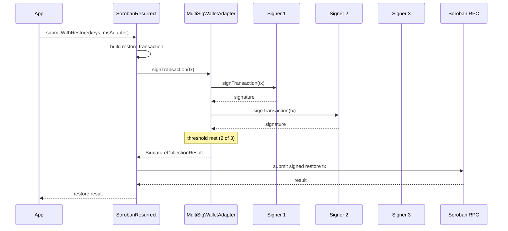

# Types

All types below are exported from `@soroban-resurrect/sdk`.

## `SorobanResurrectConfig`

Configuration options for creating a `SorobanResurrect` instance.

This is the canonical reference for `SorobanResurrectConfig` — every field below is
cross-checked against [`types.ts`](https://github.com/Automated-Cross-Contract-SDK/Automated-Cross-Contract-SDK-Frontend-/blob/main/packages/sdk/src/types.ts).
Other documents (`README.md`, `docs/API.md`, `ARCHITECTURE.md`) link back here instead
of maintaining their own copy of the field list.

```typescript
interface SorobanResurrectConfig {
  rpcUrl: string
  networkPassphrase?: string // default: resolved from rpcUrl, else Testnet
  pollIntervalMs?: number // default: 1000
  pollTimeoutMs?: number // default: 60000
  restoreFeeMultiplier?: number // default: 3 — see "Choosing restoreFeeMultiplier" below
  archiveDetectionMethod?: 'simulation' | 'direct' // default: 'simulation'
  archiveDetectionChunkSize?: number // default: 50
  archiveDetectionConcurrency?: number // default: 4
}
```

| Field                     | Description                                                                 |
| -------------------------- | ------------------------------------------------------------------------------ |
| `rpcUrl`                   | URL of the Soroban RPC endpoint.                                               |
| `networkPassphrase`        | Network passphrase (defaults to Testnet).                                      |
| `pollIntervalMs`           | Polling interval in ms when waiting for transaction confirmation.              |
| `pollTimeoutMs`             | Timeout in ms when waiting for transaction confirmation.                       |
| `restoreFeeMultiplier`     | Multiplier applied to `minResourceFee` when building a restore transaction.    |
| `archiveDetectionMethod`   | Method for detecting archived keys: `'simulation'` (default) or `'direct'`.    |
| `archiveDetectionChunkSize` | Ledger keys per `getLedgerEntries` request during `'direct'` detection.       |
| `archiveDetectionConcurrency` | Chunk requests kept in flight at once during `'direct'` detection.          |

## `WalletAdapter`

Wallet interface that wraps browser or extension wallets (e.g. Freighter).

```typescript
interface WalletAdapter {
  isConnected(): Promise<boolean>
  getPublicKey(): Promise<string>
  signTransaction(
    tx: string,
    opts?: { networkPassphrase?: string; network?: string },
  ): Promise<string>
}
```

## `KnownWallet`

Union of the wallet identifiers the SDK ships adapters for. Pass one of these to
[`createAdapter`](#createadapter) to get a ready-to-use `WalletAdapter`.

```typescript
type KnownWallet =
  | 'freighter'
  | 'xbull'
  | 'albedo'
  | 'ledger'
  | 'trezor'
```

| Value       | Adapter                  | Notes                                                                 |
| ----------- | ------------------------ | --------------------------------------------------------------------- |
| `freighter` | `FreighterWalletAdapter` | Browser extension; injected `window.freighterApi`.                    |
| `xbull`     | `XBullWalletAdapter`     | Browser extension; injected `window.xBullSDK`.                        |
| `albedo`    | `AlbedoWalletAdapter`    | Web-based signer; no extension required.                              |
| `ledger`    | `LedgerWalletAdapter`    | Hardware; requires a transport and a manifest — see below.            |
| `trezor`    | `TrezorWalletAdapter`    | Hardware; requires a transport and a manifest — see below.            |

`SUPPORTED_WALLETS` is the runtime array of every `KnownWallet` value, in the
order shown above. Use it to render a wallet picker without hard-coding the list:

```typescript
import { SUPPORTED_WALLETS } from '@soroban-resurrect/sdk'

SUPPORTED_WALLETS // ['freighter', 'xbull', 'albedo', 'ledger', 'trezor']
```

## `createAdapter`

Factory that returns a `WalletAdapter` for a given `KnownWallet` (or a custom
adapter you supply). It is the recommended entry point — it keeps the
capability flags and hardware configuration in one place.

```typescript
function createAdapter(
  wallet: KnownWallet,
  config?: LedgerAdapterConfig | TrezorAdapterConfig,
): WalletAdapter
```

```typescript
import { createAdapter } from '@soroban-resurrect/sdk'

const wallet = createAdapter('freighter')
const publicKey = await wallet.getPublicKey()
```

### Capabilities

Every adapter exposes a `capabilities` object. The SDK reads these flags to
decide which code paths are safe to take:

```typescript
interface WalletCapabilities {
  signTransaction: boolean
  signAuthEntry: boolean
  hardware: boolean
  blindSigning: boolean
}
```

| Flag              | Meaning                                                                 | SDK behaviour that depends on it                                                                 |
| ----------------- | ----------------------------------------------------------------------- | ------------------------------------------------------------------------------------------------ |
| `signTransaction` | The adapter can sign a full transaction.                                | Required by `submitWithRestore`; if `false`, the workflow throws before submitting.              |
| `signAuthEntry`   | The adapter can sign a Soroban auth entry.                              | Enables the auth-entry signing path; skipped when `false`.                                       |
| `hardware`        | The adapter signs on a physical device.                                 | Switches the workflow to hardware UX: longer timeouts and signing prompts that wait for the device. |
| `blindSigning`    | The device can sign a payload it cannot fully display.                  | When `false`, the SDK warns before requesting a signature that would be blind-signed.            |

### Hardware setup (Ledger and Trezor)

Hardware adapters need a transport to talk to the device and a manifest so the
device can show what it is signing. Install the transport packages alongside the
SDK:

```bash
# Ledger
npm install @ledgerhq/hw-transport-webhid @ledgerhq/hw-app-str

# Trezor
npm install @trezor/connect-web
```

Then pass the transport and manifest through the adapter config:

```typescript
import { createAdapter } from '@soroban-resurrect/sdk'
import TransportWebHID from '@ledgerhq/hw-transport-webhid'

const ledger = createAdapter('ledger', {
  transport: await TransportWebHID.create(),
  manifest: {
    name: 'My Soroban App',
    url: 'https://example.com',
    icon: 'https://example.com/icon.png',
  },
})
```

```typescript
import { createAdapter } from '@soroban-resurrect/sdk'

const trezor = createAdapter('trezor', {
  manifest: {
    email: 'dev@example.com',
    appUrl: 'https://example.com',
  },
})
```

`LedgerAdapterConfig` and `TrezorAdapterConfig` are the config types accepted by
`createAdapter` for the `'ledger'` and `'trezor'` wallets respectively. Both
require a `manifest`; the Ledger config additionally requires a `transport`.

### Hardware latency and UX

Hardware signing is slower and more interactive than extension wallets. Expect:

- **Latency** — each signature requires a round-trip to the device, so signing
  can take several seconds versus near-instant for extension wallets. Keep
  `pollTimeoutMs` generous when the workflow includes hardware signing.
- **Confirmation** — the user must physically confirm on the device. The SDK
  surfaces this through the `onSigningRestore` / `onSigningOriginal` callbacks so
  your UI can prompt the user to check the device.
- **Blind signing** — when `capabilities.blindSigning` is `false`, the SDK warns
  before a signature the device cannot display, so users are not asked to approve
  an opaque payload.

### Custom adapters

If your wallet is not in `KnownWallet`, implement `WalletAdapter` directly and
pass it wherever a `WalletAdapter` is expected:

```typescript
import type { WalletAdapter } from '@soroban-resurrect/sdk'

const custom: WalletAdapter = {
  async isConnected() {
    return true
  },
  async getPublicKey() {
    return myProvider.publicKey
  },
  async signTransaction(tx, opts) {
    return myProvider.sign(tx, opts)
  },
}
```

## `MultiSigConfig`

Configuration for an N-of-M multisig restore. Pass it to
[`MultiSigWalletAdapter`](#multisigwalletadapter) to describe the signer set and
the threshold required to submit.

```typescript
interface MultiSigConfig {
  threshold: number
  signers: MultiSigSigner[]
}
```

| Field       | Description                                                                 |
| ----------- | --------------------------------------------------------------------------- |
| `threshold` | Number of signatures required before the restore can be submitted (`N`).    |
| `signers`   | The signer set (`M`). Each entry is a [`MultiSigSigner`](#multisigsigner).  |

## `MultiSigSigner`

A single participant in a multisig restore. Each signer wraps a `WalletAdapter`
so the SDK can request a signature from that wallet.

```typescript
interface MultiSigSigner {
  publicKey: string
  adapter: WalletAdapter
}
```

| Field       | Description                                                              |
| ----------- | ------------------------------------------------------------------------ |
| `publicKey` | The signer's Stellar public key (`G...`).                                |
| `adapter`   | The [`WalletAdapter`](#walletadapter) used to collect this signer's signature. |

## `MultiSigWalletAdapter`

A `WalletAdapter` that coordinates an N-of-M restore. It builds the restore
transaction, collects signatures from each signer until the threshold is met,
then submits the fully-signed transaction.

```typescript
class MultiSigWalletAdapter implements WalletAdapter {
  constructor(config: MultiSigConfig)

  collectSignatures(tx: string): Promise<SignatureCollectionResult>
}
```

Because it implements `WalletAdapter`, a `MultiSigWalletAdapter` can be passed
directly to [`submitWithRestore`](#submitwithrestore) — the collect-then-submit
flow is driven for you.

## `SignatureCollectionResult`

Returned by `MultiSigWalletAdapter.collectSignatures`. Describes how many
signatures were gathered and whether the threshold was reached.

```typescript
interface SignatureCollectionResult {
  signedTx: string
  signatures: string[]
  thresholdMet: boolean
  refused: string[]
}
```

| Field          | Description                                                                 |
| -------------- | --------------------------------------------------------------------------- |
| `signedTx`     | The transaction envelope with the collected signatures attached.            |
| `signatures`   | Signatures collected, in the order they were gathered.                      |
| `thresholdMet` | `true` when `signatures.length >= config.threshold`.                        |
| `refused`      | Public keys of signers that declined or failed to sign.                     |

## Multisig restore flow

A multisig restore is a **collect-then-submit** flow: build the restore
transaction, gather signatures from each signer until the threshold is met, then
submit the fully-signed transaction. `MultiSigWalletAdapter` implements
`WalletAdapter`, so it composes with `submitWithRestore` and `restoreKeys`
exactly like a single-signer wallet.



### Composing with `submitWithRestore` and `restoreKeys`

`restoreKeys` detects which ledger keys are archived and builds the restore
transaction. `submitWithRestore` then signs and submits it. When the wallet you
pass is a `MultiSigWalletAdapter`, `submitWithRestore` calls
`collectSignatures` internally instead of a single `signTransaction`, so the
same call site works for both single-signer and multisig wallets:

```typescript
import {
  SorobanResurrect,
  MultiSigWalletAdapter,
  createAdapter,
} from '@soroban-resurrect/sdk'

const sdk = new SorobanResurrect({ rpcUrl: 'https://soroban-testnet.stellar.org' })

const multisig = new MultiSigWalletAdapter({
  threshold: 2,
  signers: [
    { publicKey: 'GAAA...', adapter: createAdapter('freighter') },
    { publicKey: 'GBBB...', adapter: createAdapter('xbull') },
    { publicKey: 'GCCC...', adapter: createAdapter('albedo') },
  ],
})

// restoreKeys builds the restore tx; submitWithRestore collects signatures
// from the multisig adapter and submits once the threshold is met.
const result = await sdk.submitWithRestore(keys, multisig)
```

### Worked 2-of-3 example

Three signers, any two of which can authorize the restore:

```typescript
import {
  SorobanResurrect,
  MultiSigWalletAdapter,
  createAdapter,
} from '@soroban-resurrect/sdk'

const sdk = new SorobanResurrect({ rpcUrl: 'https://soroban-testnet.stellar.org' })

const multisig = new MultiSigWalletAdapter({
  threshold: 2,
  signers: [
    { publicKey: 'GAAA...', adapter: createAdapter('freighter') },
    { publicKey: 'GBBB...', adapter: createAdapter('xbull') },
    { publicKey: 'GCCC...', adapter: createAdapter('albedo') },
  ],
})

// 1. Detect archived keys and build the restore transaction.
const keys = await sdk.restoreKeys(['G...contractDataKey'])

// 2. Collect signatures. The adapter stops once `threshold` (2) is reached.
const collection = await multisig.collectSignatures(keys.restoreTx)

if (!collection.thresholdMet) {
  throw new Error(`Only ${collection.signatures.length} of 2 signatures collected`)
}

// 3. Submit the fully-signed restore transaction.
const result = await sdk.submitWithRestore(keys, multisig)
```

### Failure handling for a refusing signer

A signer can decline (user rejects the prompt) or fail to sign (device error,
timeout). The adapter records those public keys in `SignatureCollectionResult.refused`
and keeps collecting from the remaining signers — one refusal does not abort the
flow as long as the threshold is still reachable.

```typescript
const collection = await multisig.collectSignatures(keys.restoreTx)

if (collection.refused.length > 0) {
  console.warn('Signers that refused:', collection.refused)
}

if (!collection.thresholdMet) {
  // Not enough signatures — surface which signers are still needed.
  const needed = multisig.config.threshold - collection.signatures.length
  throw new Error(`Restore needs ${needed} more signature(s)`)
}
```

Guidance:

- **Threshold still reachable** — continue collecting; the refused signer is
  skipped and listed in `refused`.
- **Threshold no longer reachable** — `thresholdMet` is `false`. Do not submit;
  prompt the user to retry with a different signer or re-collect.
- **Retrying** — call `collectSignatures` again on the same restore transaction;
  already-collected signatures are preserved and only missing ones are requested.
