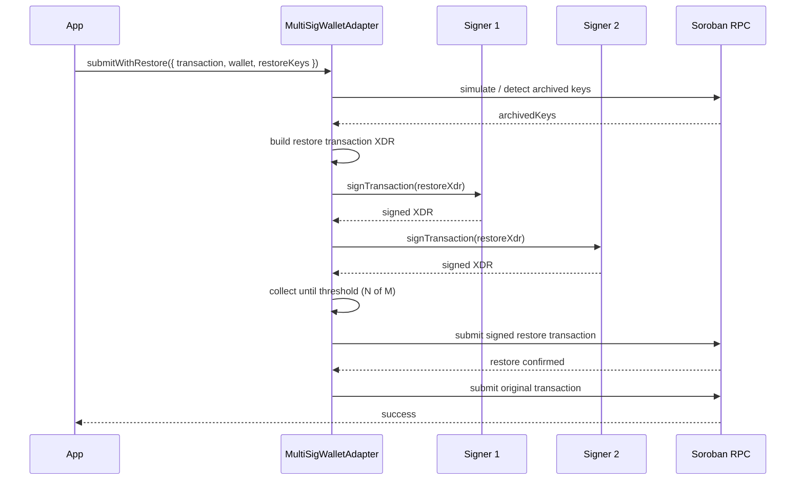

# Tutorial: Common Use Cases

This tutorial walks through the scenarios you'll run into most often when integrating Soroban-Resurrect into a dApp.

## 1. Checking restoration status before submitting

Sometimes you want to warn the user ("this will require an extra signature") before they commit to an action:

```typescript
const needsRestore = await sr.needsRestore(tx)

if (needsRestore) {
  console.log('This transaction touches archived state and will need an extra restore step.')
}
```

`needsRestore` runs a simulation under the hood and does not mutate any on-chain state — it's safe to call speculatively, e.g. on hover or on page load.

## 2. Submitting with full lifecycle callbacks

`submitWithRestore` accepts optional callbacks for every stage of the flow, which is useful for driving a progress UI:

```typescript
const result = await sr.submitWithRestore({
  transaction: tx,
  wallet,
  onRestoreNeeded: (archivedKeys) => {
    console.log(`${archivedKeys.length} archived ledger entries detected`)
  },
  onSigningRestore: () => setStatus('Confirm the restore transaction in your wallet…'),
  onSubmittingRestore: () => setStatus('Submitting restore transaction…'),
  onRestoreSubmitted: (txHash) => setStatus(`Restore tx sent: ${txHash}`),
  onRestoreConfirmed: (txHash) => setStatus('Restore confirmed, preparing original transaction…'),
  onSigningOriginal: () => setStatus('Confirm your transaction in your wallet…'),
  onOriginalSubmitted: (txHash) => setStatus(`Done: ${txHash}`),
  onRestoreFailed: (error) => setStatus(`Restore failed: ${error}`),
})
```

If no restoration is needed, only `onSigningOriginal` and `onOriginalSubmitted` fire.

## 3. Subscribing to state changes globally

Instead of (or in addition to) per-call callbacks, you can subscribe once and react to every state transition the SDK instance goes through:

```typescript
const unsubscribe = sr.onStateChange((info) => {
  // info: { state, message, archivedKeys?, error? }
  console.log(info.state, '-', info.message)
})

// later, when the component unmounts
unsubscribe()
```

`RestoreState` is one of: `idle`, `simulating`, `restore_needed`, `signing_restore`, `submitting_restore`, `confirming_restore`, `signing_original`, `submitting_original`, `success`, `error`.

## 4. Detecting archived keys without submitting anything

To build diagnostic tooling (e.g. "which of my contract's storage keys are archived right now?"), use `detectArchivedKeys` directly:

```typescript
const archivedKeys = await sr.detectArchivedKeys(tx)

for (const entry of archivedKeys) {
  console.log(entry.keyBase64)
}
```

## 5. Choosing a detection method

By default, archive detection piggybacks on the simulation response (`archiveDetectionMethod: 'simulation'`). If you want to query the ledger directly for footprint keys instead — useful for monitoring dashboards that shouldn't trigger a restore-response code path — configure `'direct'`:

```typescript
const sr = new SorobanResurrect({
  rpcUrl: 'https://soroban-testnet.stellar.org',
  archiveDetectionMethod: 'direct',
})
```

## 6. Tuning the restore fee and polling behavior

```typescript
const sr = new SorobanResurrect({
  rpcUrl: 'https://soroban-testnet.stellar.org',
  restoreFeeMultiplier: 5, // default: 3
  pollIntervalMs: 2000, // default: 1000
  pollTimeoutMs: 90_000, // default: 60000
})
```

`restoreFeeMultiplier` scales the resource fee reported by simulation to compute the restore transaction's fee — raise it on networks with volatile fees to reduce the chance of underpaying. See [Choosing `restoreFeeMultiplier`](/api/types#choosing-restorefeemultiplier) for the full trade-off.

## 7. Resetting state between actions

If you're reusing the same `SorobanResurrect` instance across multiple user actions in a single-page app, reset its state machine between them:

```typescript
sr.reset() // back to 'idle', clears last error/archived keys
```

## 8. Writing a custom WalletAdapter

Any wallet can be adapted with three methods:

```typescript
import type { WalletAdapter } from '@soroban-resurrect/sdk'

const myWallet: WalletAdapter = {
  isConnected: async () => Boolean(window.myWallet?.isConnected),
  getPublicKey: async () => window.myWallet.getPublicKey(),
  signTransaction: async (txXdr, opts) =>
    window.myWallet.sign(txXdr, { networkPassphrase: opts?.networkPassphrase }),
}
```

## 9. Restoring with an N-of-M multisig account

When the account that pays for the restore is a multisig account (e.g. a treasury or a DAO vault), a single `signTransaction` call is not enough: the restore transaction must be signed by `N` of its `M` signers before it can be submitted. The SDK models this with `MultiSigWalletAdapter`, `MultiSigSigner`, `MultiSigConfig`, and `SignatureCollectionResult`.

The flow is **build → collect → submit**:

1. **Build** the restore transaction. `MultiSigWalletAdapter` wraps the underlying wallet and produces the unsigned restore transaction XDR from the archived keys.
2. **Collect** signatures from each signer. Each `MultiSigSigner` signs the same XDR independently; the adapter accumulates the results into a `SignatureCollectionResult` until the configured threshold is met.
3. **Submit** the fully-signed restore transaction, then continue with the original transaction as usual.

### Sequence diagram



### Worked 2-of-3 example

A 2-of-3 treasury: any two of `alice`, `bob`, and `carol` must sign the restore transaction.

```typescript
import {
  SorobanResurrect,
  MultiSigWalletAdapter,
  type MultiSigSigner,
  type MultiSigConfig,
} from '@soroban-resurrect/sdk'

const signers: MultiSigSigner[] = [
  { publicKey: alicePublicKey, signTransaction: (xdr) => aliceWallet.sign(xdr) },
  { publicKey: bobPublicKey, signTransaction: (xdr) => bobWallet.sign(xdr) },
  { publicKey: carolPublicKey, signTransaction: (xdr) => carolWallet.sign(xdr) },
]

const config: MultiSigConfig = {
  signers,
  threshold: 2, // 2-of-3
}

const wallet = new MultiSigWalletAdapter({
  config,
  // the account whose signature pays for and authorizes the restore
  publicKey: treasuryPublicKey,
})

const sr = new SorobanResurrect({ rpcUrl: 'https://soroban-testnet.stellar.org' })

const result = await sr.submitWithRestore({
  transaction: tx,
  wallet,
  // restoreKeys scopes the restore to the archived entries you detected;
  // omit it to let the SDK derive them from simulation.
  restoreKeys: archivedKeys,
})

console.log(result.hash)
```

`submitWithRestore` drives the same lifecycle as in section 2, but delegates signing to the multisig adapter: it builds the restore transaction, asks each signer for a signature, and only submits once `threshold` signatures have been collected. `restoreKeys` lets you pass the exact archived keys to restore (for example the output of `detectArchivedKeys`); when omitted, the SDK derives them from simulation.

### Handling a signer that refuses

A signer may reject the request (user cancels, hardware wallet unplugged, policy denies the signature). The adapter surfaces this as a failed `SignatureCollectionResult` rather than submitting a partially-signed transaction:

```typescript
const result = await sr.submitWithRestore({
  transaction: tx,
  wallet,
  restoreKeys: archivedKeys,
  onRestoreFailed: (error) => {
    // e.g. "signature collection failed: signer G... refused"
    console.error('Restore aborted:', error)
  },
})
```

Because the threshold was never reached, no restore transaction is submitted and the original transaction is left untouched — the caller can retry with a different set of signers. If you collect signatures yourself, inspect the `SignatureCollectionResult` before submitting:

```typescript
const collection = await wallet.collectSignatures(restoreXdr)

if (!collection.satisfied) {
  // collection.signatures holds the ones you did get; collection.missing
  // lists the signers that have not signed yet.
  throw new Error(`Need ${collection.missing.length} more signature(s)`)
}

await sr.submitRestore(collection.transaction)
```
